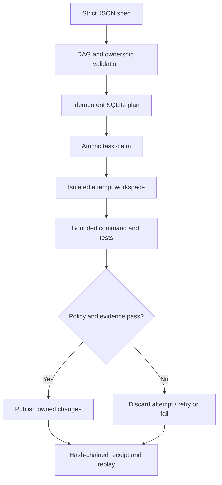

# AI Software Factory

Optional [native execution quotas](docs/execution-quota-contract.md) reserve
command/test capacity in the existing durable Store. Calls, raw retained output
and elapsed execution are accounted separately; unknown results retain their
reservation. This does not measure provider tokens or cost.

AI Software Factory is a dependency-free Python 3.11+ runtime for turning a
strict JSON build plan into a durable, replayable local execution. It is built
for agents and humans that need more than a prompt loop: explicit ownership,
dependency ordering, bounded execution, crash recovery, and content-addressed
evidence.

The project is local-only. It does not call a model API, fetch dependencies at
runtime, or require a hosted control plane.

**Release status:** the repository currently prepares version `1.0.0` as a
`PREPARED` candidate. `release-policy.v1.json` keeps `publish_enabled=false`;
normal CI cannot create a tag, GitHub Release, or package publication. Rollback
is explicitly documented to `0.1.0`. See [Migration to 1.0](MIGRATION-1.0.md)
and [the release contract](docs/release.md).

## What makes it a factory

- Strict, versioned JSON specifications with unknown-field rejection.
- Deterministic DAG validation, deep-cycle detection, and topological planning.
- Exact and ancestor/descendant path-ownership conflict detection.
- SQLite task, run, receipt, and hash-chained event persistence.
- Atomic ready-task claiming across workers with renewable lease heartbeats,
  stale-worker fencing, and recovery after one configured lease interval.
- Explicit run/task state machines and dependency-failure propagation.
- Per-task and global attempt budgets, a wall-time deadline applied across task
  commands, tests, evidence, and publication, exponential backoff, and an
  operator kill switch.
- Provider and executor protocols, a deterministic mock, and a subprocess
  executor using argument arrays, `shell=False`, a timeout, a minimal
  environment, process-group cleanup on POSIX even when the direct parent exits
  first, and a combined output cap.
- Isolated workspace copy per attempt. Failed or policy-violating attempts are
  discarded; declared changes are pre-staged, backed up, and compensated if a
  handled publication or database transition fails.
- Publication is lease-fenced inside the completion transaction and every file
  is rehashed while copied against the captured ownership snapshot.
- Evidence receipts with command/output digests, expected and executed tests,
  artifact hashes, ownership deltas, and a consistent-snapshot export whose
  receipt identities and completion events are verified offline.
- Idempotent planning and completion, deterministic replay, and JSON-only CLI
  output suitable for automation.
- Optional attempt-bound local approvals, expiry checks at claim/publication,
  and durable approval waiting. Declared actors are not authenticated identities.
  See the [approval contract](docs/approval-contract.md).

## Five-minute tour

```bash
python -m pip install --no-deps -e .

ai-software-factory init demo
ai-software-factory validate demo/factory.json
ai-software-factory plan demo/factory.json --idempotency-key tour-001
ai-software-factory run demo/factory.json --idempotency-key tour-001
```

The starter performs a synthetic, offline Python build and contract test. Its
database is `demo/.factory/factory.sqlite3`; its canonical task workspace is
`demo/.factory/workspace`.

Inspect and export the run using the `run_id` printed by `plan` or `run`:

```bash
ai-software-factory status --db demo/.factory/factory.sqlite3 --run-id RUN_ID
ai-software-factory replay --db demo/.factory/factory.sqlite3 --run-id RUN_ID
ai-software-factory export --db demo/.factory/factory.sqlite3 --run-id RUN_ID \
  --output demo/evidence.json
ai-software-factory verify demo/evidence.json
```

## Execution lifecycle



## Specification at a glance

```json
{
  "schema_version": 1,
  "name": "synthetic-build",
  "workspace": ".factory/workspace",
  "budget": {
    "max_tasks": 20,
    "max_attempts": 40,
    "max_wall_seconds": 300,
    "max_output_bytes": 1048576,
    "default_task_timeout_seconds": 30,
    "lease_seconds": 60,
    "retry_base_seconds": 1,
    "retry_cap_seconds": 30,
    "default_max_attempts": 3
  },
  "tasks": [
    {
      "id": "build",
      "owner": "local-builder",
      "command": ["python", "-c", "print('synthetic build')"],
      "owned_paths": ["artifacts"],
      "artifacts": [],
      "tests": []
    }
  ]
}
```

Commands are argument arrays, never shell strings. Task IDs, dependencies,
paths, timeouts, environment values, and budgets are validated before a run is
created. Secret-looking environment names are rejected because specifications,
events, and exports must remain safe to share.

See [the specification](docs/specification.md) and the complete
[synthetic example](examples/factory.json).

## CLI contract

| Command | Purpose |
| --- | --- |
| `init [DIR]` | Create a non-destructive synthetic starter specification. |
| `validate SPEC` | Parse strictly and print the digest plus topological order. |
| `plan SPEC` | Persist an idempotent run without executing it. |
| `run SPEC` | Plan/resume until a terminal state or explicit approval wait. |
| `approval-request` | Inspect the exact ready task/attempt contract to review. |
| `approval-decide` | Journal a matching, expiring local decision. |
| `status` | Return the durable run/task snapshot. |
| `replay` | Verify and return the ordered event chain. |
| `export` | Export spec, status, events, receipts, and a root digest. |
| `verify FILE` | Verify an export without opening its database. |
| `kill` | Activate the durable run kill switch with a reason. |

Successful commands return `0`. Invalid input, a failed/cancelled run, or
verification failure returns `2`. Approval waiting returns `3` and is not success.
Machine-readable results go to stdout;
machine-readable errors go to stderr.

Planning is idempotent. Reusing the same idempotency key with the same spec
returns the same run; using it with a different spec is an error. Without an
explicit key, the canonical spec digest is used, so repeated invocations resume
the same run intentionally.

## Evidence model

Raw stdout and stderr are not stored. A receipt records their full-stream
SHA-256 digests, byte counts, captured-prefix counts, and truncation status.
Declared regular-file artifacts are hashed. Every expected test is represented,
including tests that were not run after an earlier failure.

Events form a SHA-256 chain and the run row anchors its event count and head.
Exports verify stored receipts and carry their own digest. This detects
accidental corruption and ordinary tampering; it is not a digital signature.
Use an external signing or transparency system if hostile database administrators
are in scope.

## Reusable workflow templates

An explicit catalog can parameterize a trusted native recipe, then use the same
Engine, Store, approvals, quotas and evidence pipeline:

```bash
ai-software-factory template-compile examples/template-catalog.json --template text-component-v1 --bindings examples/template-bindings.json
ai-software-factory template-run examples/template-catalog.json --template text-component-v1 --bindings examples/template-bindings.json
```

The example generates and tests a Python component with the supplied prefix.
Use `template-plan` to inspect a durable run before execution. The catalog is
operator-authored code; parameters can affect only names/descriptions and
`FACTORY_INPUT_*` values. Commands, paths, task ownership and policy stay fixed.
The journal retains normalized template/bindings and verifies their relationship
to the effective spec. It does not authenticate the author. Read the
[template contract](docs/template-contract.md), including the remaining
worktree and independent-workspace limits.

## Trust boundary

The subprocess executor is bounded process execution, not an operating-system
sandbox. A specification is trusted local code and can invoke any executable
available to the current account. Run untrusted specifications only inside a
separate OS sandbox, container, VM, or disposable account.

The factory minimizes inherited environment data, never invokes a shell, confines
provider requests to the exact attempt workspace and factory timeout/output
policy, rejects symlink publication, and detects writes outside declared
ownership inside the attempt workspace. These controls reduce mistakes; they do
not replace OS isolation. Read the [security model](docs/security-model.md).

## Legacy compatibility

The original gate remains available:

```bash
ai-software-factory record.json
```

It validates `mission`, `owner`, `tests_passed`, and `tests_total`, emits a
tamper-evident envelope, and preserves the original `0`/`2` exit behavior.
`evaluate()` and `verify_evidence()` remain public Python APIs.

## Release evidence

Flagship CI runs Ubuntu, Windows, and macOS across CPython 3.11, 3.12, and 3.13.
Every job builds wheel plus source distribution with the pinned toolchain,
installs and tests the real wheel, executes the full runtime suite and a portable
positive/negative/blocked legacy counter-proof, smokes the CLI outside checkout,
and tests the complete source distribution.

Each job also produces `SHA256SUMS.txt`, CycloneDX 1.6
`ai-software-factory.cdx.json`, and `RELEASE_EVIDENCE.json`. The receipt remains
`PREPARED` and records release booleans as false. After the 9-job matrix, a
guarded owner/same-repository job signs the canonical Ubuntu/Python 3.11 wheel
with GitHub/Sigstore SLSA provenance and then verifies it with
`gh attestation verify` constrained by repository, signer workflow, source ref,
source digest, and GitHub-hosted runner policy.

Signed provenance is evidence, not publication authorization. A separate
reviewed change is required to enable publication and must retain rollback plus
post-publication read-back verification.

## Development

```bash
PYTHONPATH=src python -m unittest discover -s tests -v
PYTHONPATH=src python scripts/check.py
python scripts/check_release_policy.py
python scripts/verify_counterproof.py
```

The runtime has no third-party dependencies. See [CONTRIBUTING.md](CONTRIBUTING.md),
[architecture](docs/architecture.md), [AI assistance disclosure](AI_ASSISTANCE.md),
and [CHANGELOG.md](CHANGELOG.md).

Apache-2.0.
