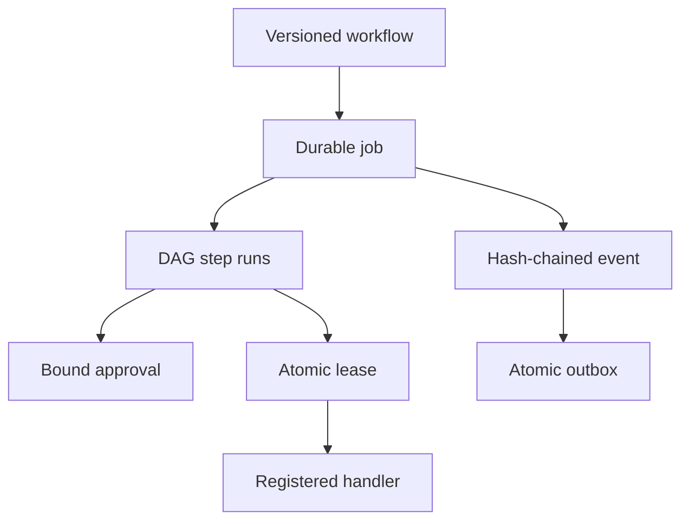

# Architecture

## Boundaries

The package has two deliberately separate public seams:

1. `core.run`, `core.simulate`, and `core.transition` preserve the original stateless contract. JSON input can simulate but cannot grant itself authority.
2. `ControlPlane` coordinates authenticated principal names, RBAC capabilities, immutable definitions, durable state, workers, and recovery.

`ControlPlaneStore` owns SQLite connections, schema migration, and hash-chain mechanics. `WorkflowDefinition` owns untrusted document validation. `HandlerRegistry` is the only route from a workflow handler name to executable Python and binds that handler to a trusted capability selected by startup code.

## State topology



All decision-relevant records live in one SQLite database. Each mutation begins with `BEGIN IMMEDIATE`, re-reads trusted state inside that transaction, applies an optimistic predicate where appropriate, writes state, appends one or more audit events, and writes matching outbox envelopes before commit.

## Workflow immutability

The canonical representation uses sorted, whitespace-free UTF-8 JSON. Its SHA-256 digest is stored with every workflow and job. `(workflow_id, version)` is immutable: registering identical content is idempotent; registering different content at an existing version is a conflict. Jobs always load their pinned version rather than the latest active definition.

## Job and step states

Jobs use `queued`, `running`, `waiting_approval`, `completed`, `failed`, or `cancelled`. Steps use `blocked`, `ready`, `waiting_approval`, `leased`, `succeeded`, `failed`, `cancelled`, or `skipped`.

Dependencies promote only after every prerequisite succeeds. A failed/rejected/cancelled prerequisite causes downstream blocked steps to become `skipped`. A step requiring approval enters `waiting_approval` only after its dependencies have succeeded, ensuring the approval applies to executable work rather than a speculative future state.

A terminal job is a fencing boundary: every nonsucceeded active step becomes terminal, every lease and reservation is cleared, and the job fence generation advances. Recovery excludes terminal jobs, so it cannot resurrect work. A later kill-switch disable changes policy for new work only; it does not roll back a job fence.

An idempotency key is unique per workflow ID and binds the submitter, workflow version, trigger, payload, budget, deadline request, and dry-run flag. Repeating the same request returns the original job; reusing the key for different content or another principal is a conflict.

## Leases and concurrency

A worker claim is serialized by SQLite and contains:

- job and step identity;
- owner identity;
- a random token stored only for that claim;
- an expiry bounded by the requested lease and step timeout;
- the job fence generation current at claim;
- an atomic reservation of the step estimate;
- an incremented attempt count and step version.

The clock is sampled only after the write lock is acquired. Completion checks owner, token, state, fence generation, lease expiry, job deadline, kill switches, and budget within that transaction. A stale worker cannot complete after recovery, cancellation, terminal failure, or a kill epoch. This produces at-least-once handler invocation semantics with exactly-once acceptance of a lease result. Handlers must therefore be idempotent at external side-effect boundaries.

## Approval binding

An approval binds:

- approval ID;
- job and step ID;
- workflow digest;
- job version at decision;
- exact step version authorized for claim;
- canonical input digest;
- decision, approver, reason, and timestamps.

The decision path requires the stored pending approval to match the current workflow, input, job version, and step version. Normal state transitions update those bindings atomically; the claim path verifies all four again. A non-admin principal cannot approve a job it submitted unless explicitly granted `approval:self`. Job state is always derived from all steps, so approving one step cannot change a job with another live lease from `running` to `queued`.

When an approved attempt fails or its lease expires, recovery carries the approval's authorized step version forward only to the retry of that same immutable workflow/input digest. Definition or input changes require a new workflow version and therefore cannot reuse the approval.

## Budgets, retries, and deadlines

Costs are nonnegative integers to avoid floating-point ambiguity. A workflow caps the sum of estimates. A job can lower but not raise that cap. Claim reserves the estimate atomically before a handler can run. Other workers see that reservation and cannot oversubscribe the job. Failure/recovery releases it; accepted success atomically replaces it with the reported actual cost. If temporary reservations consume capacity, other ready steps wait; once settled, a step whose estimate can never fit the remaining budget fails closed.

Retry delays follow `min(max_delay, initial_delay * multiplier ** (attempts - 1))`. Maximum attempts, delay, handler timeout, and job deadline are all schema-bounded. Expired jobs fail during recovery; retries never extend the original job deadline.

## Safe handler extension

Create a registry during trusted application startup:

```python
from automation_control_plane import HandlerRegistry, HandlerResult

registry = HandlerRegistry()

def reviewed_handler(context):
    # Validate input again at the real side-effect boundary.
    return HandlerResult({"accepted": True}, cost_units=1)

registry.register(
    "reviewed.action",
    reviewed_handler,
    required_capability="handler:reviewed.action",
)
```

Then construct `ControlPlane(store, registry=registry)` and grant the worker role the registry-bound capability plus any additional capability declared by the workflow step. The registry binding is authoritative: workflow JSON cannot substitute a weaker capability. Do not create a generic handler that accepts a command, URL, module path, query, or script; doing so bypasses the architecture's principal safety property.

## Durability model

SQLite schema version `2` runs with foreign keys, WAL, `synchronous=FULL`, a busy timeout, strict tables, checks, and unique constraints. Initialization performs a read-only version preflight, refuses future/unknown schemas without mutation, and transactionally migrates version `1`. The event chain is anchored by an event count and head hash held in metadata; every successful result has a canonical digest repeated in its anchored success event, and every outbox envelope is re-derived from that event during verification. The online backup API refuses symlink/existing destinations, publishes without overwrite, and revalidates the copied schema, integrity, chain, receipts, and outbox before publication. Restore copies to a private temporary file, migrates when supported, rejects unexpected tables, columns, triggers, or views, validates the complete required schema/index semantics, foreign keys, SQLite integrity, audit anchors, result receipts, and outbox, then atomically replaces the exact target.
